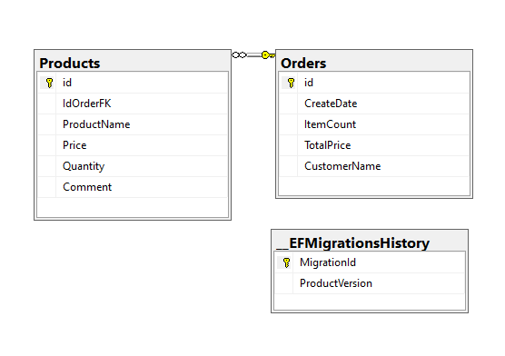

# ORDERS & PRODUCTS APP

**Table of Contents**📑

[TOCM]

[TOC]

## Project Description 🌟

The project is based on two main components: BackEnd and FrontEnd. The BackEnd is an API project implemented with NETCORE - EntityFramework, structured in 4 layers to ensure robustness and scalability. Its database is implemented with Microsoft SQL Server, and the DB script file is located in the Db folder. The FrontEnd is a WebAssembly project using Blazor, allowing the front end to run on the client side. It implements a single-layer component structure, making it scalable to other platform configurations thanks to the .NET environment.

## Features 📈

The project includes versioning and rate limiting.

## Technologies  💻

-   NetCore 7.0
-   Blazor
-   MySQL
-   GitHub
-   SQL Server

### Languages 💬

-   C#
-   Razor
-   HTML
-   CSS

### Dependencies 📦

#### FrontEnd Dependencies
-   Microsoft.AspNetCore.Components.WebAssembly
-   Microsoft.AspNetCore.Components.WebAssembly.DevServer Version="7.0.10"
-   Microsoft.AspNetCore.Http Version="2.2.2"
-   Newtonsoft.Json Version="13.0.3""
-   EPPlus Version="5.8.1"

#### Dependencies
-   AspNetCoreRateLimit Version="5.0.0"
-   AutoMapper.Extensions.Microsoft.DependencyInjection Version="12.0.1"
-   Microsoft.AspNetCore.Authentication.JwtBearer Version="7.0.12"
-   Microsoft.AspNetCore.Mvc.Versioning Version="5.1.0"
-   Microsoft.AspNetCore.OpenApi Version="7.0.12"
-   Microsoft.EntityFrameworkCore Version="7.0.12"
-   Microsoft.EntityFrameworkCore.Design Version="7.0.12"
-   Microsoft.Extensions.DependencyInjection Version="7.0.0"
-   Swashbuckle.AspNetCore Version="6.5.0"
-   System.IdentityModel.Tokens.Jwt Version="7.0.3"
-   Microsoft.IdentityModel.Tokens Version="7.0.3"
-   Serilog.AspNetCore Version="7.0.0"
-   FluentValidation.AspNetCore Version="11.3.0"
-   itext7.pdfhtml Version="5.0.1"
-   Pomelo.EntityFrameworkCore.MySql Version="7.0.0"
-   CsvHelper Version="30.0.1"

## Database Structure  🧱

> General Structure.

